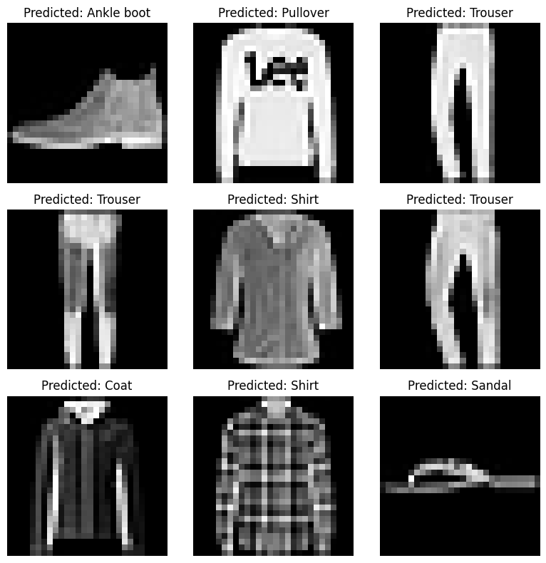

# 👕 Fashion MNIST Image Classification using CNN

A deep learning project that uses a **Convolutional Neural Network (CNN)** built with TensorFlow and Keras to classify grayscale clothing images from the Fashion MNIST dataset into 10 different categories.

---

## Project Preview



---

## Features

- Image classification using CNN
- Built with TensorFlow and Keras
- Uses the Fashion MNIST dataset (70,000 images)
- Predicts 10 clothing categories
- Visualizes classified images with predicted labels

---

## Technologies Used

- Python
- TensorFlow
- Keras
- NumPy
- Matplotlib

---

## Dataset

The Fashion MNIST dataset contains 70,000 grayscale images (28×28 pixels) across 10 categories:

- T-shirt/Top
- Trouser
- Pullover
- Dress
- Coat
- Sandal
- Shirt
- Sneaker
- Bag
- Ankle Boot

---

## Model Architecture

```text
Input Layer (28x28x1)
        ↓
Conv2D (32 Filters, ReLU)
        ↓
MaxPooling2D
        ↓
Conv2D (64 Filters, ReLU)
        ↓
MaxPooling2D
        ↓
Flatten
        ↓
Dense (128, ReLU)
        ↓
Dropout (0.5)
        ↓
Dense (10, Softmax)
 
